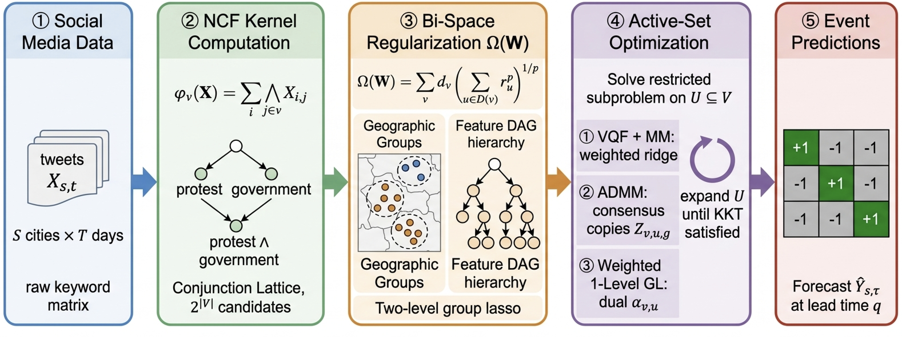

# HTNL: Hierarchical Group Lasso — Four Optimisation Methods

<p align="center">
  
  <a href="requirements.txt"></a>
</p>

Reference implementation for the paper:

> **Optimising Hierarchical Tensor-Network Lasso: A Comparative Study of
> Four Algorithms on Real-World Binary Classification Datasets**

---

## At a Glance

- **Research question.** Which optimization strategy is most reliable for hierarchical tensor-network lasso on real binary classification tasks?
- **Core idea.** The repository compares four solvers under a common data, hyperparameter, and evaluation interface.
- **What is included.** Implementations, synthetic checks, real-data runners, hyperparameter settings, and reproducibility notes.

## Overview

This repository provides Python implementations of four algorithms for
**Hierarchical Group Lasso (HTNL)** / Numerical Conjunctive Feature (NCF)
selection, evaluated on 11 real-world binary classification datasets:

| Method | Description |
|--------|-------------|
| **Original** | Variational form (Lemma 2) with alternating MM, as in TKDE 2019 |
| **VQF** | Vectorised-Quadratic Form — mathematically equivalent to Original, ~2× faster |
| **ADMM-Bisect** | ADMM with exact bisection proximal operator; replaces FISTA for hard-zero thresholding |
| **WGL-Cont (λ=1)** | Weighted one-level group-lasso continuation (Song & Zhao, NeurIPS 2024) |



### Key Findings

- **Original ≡ VQF** (Jaccard = 1.000 across all 11 datasets — bit-exact identical selection)
- All three non-collapsing methods achieve **Bonferroni-survived AUC improvement** over
  class-weighted Logistic Regression (n=11 paired t-test, α/4=0.0125):
  - Original/VQF: ΔAUC = +0.074 (p = 4×10⁻⁵ ***)
  - WGL-Cont (λ=1): ΔAUC = +0.044 (p = 0.0032 **)
  - ADMM-Bisect: ΔAUC = +0.034 (p = 0.0124 *)
- ADMM-Bisect is **3–4× faster** wall-clock than Original due to KKT-pruning
- WGL default continuation (λ: 500→50) **fully collapses** on datasets with
  positive-class fraction < 3% (10 LatAm countries); use λ=1 instead

---

## Repository Structure

```text
.
|-- README.md
|-- requirements.txt
|-- figures/
|   `-- 1-3.png                  # Algorithm comparison figure
`-- htnl/
    |-- models/
    |   |-- _core.py             # Shared Huber-hinge, weighted-ridge, active-set utilities
    |   |-- ncf.py               # NCF lattice and Phi precomputation
    |   |-- htnl_original.py     # Method 0: Original (TKDE 2019)
    |   |-- htnl_vqf.py          # Method 1: VQF/MM
    |   |-- htnl_admm.py         # Method 2: ADMM-Bisect
    |   |-- htnl_wgl.py          # Method 3: WGL-Cont
    |   `-- htnl_real_fast.py    # Vectorised single-task adapter for real data
    |-- data/
    |   `-- real_data_loader.py  # Load .mat datasets
    `-- experiments/
        |-- run_all.py           # Run all methods on synthetic data
        `-- run_real_data.py     # Run all methods on real datasets
```

---

## Installation

```bash
git clone git@github.com:Hik289/HTNL.git
cd HTNL

python -m venv .venv
source .venv/bin/activate
pip install -r requirements.txt
```

Requires Python ≥ 3.9.

---

## Data

### Real-world datasets (required for `run_real_data.py`)

The experiments use `.mat` files with the following structure:

| Key | Shape | Type | Description |
|-----|-------|------|-------------|
| `X_tr` | (n_tr, V) | uint8 | Binary feature matrix (training) |
| `X_te` | (n_te, V) | uint8 | Binary feature matrix (test) |
| `Y_tr` | (n_tr, 1) | int16 | Labels ∈ {−1, +1} (training) |
| `Y_te` | (n_te, 1) | int16 | Labels ∈ {−1, +1} (test) |

Place all `.mat` files in a single directory (e.g., `data/hkl_combined/`).

Expected filenames:
- Country files: `{country}_data.mat`  
  (argentina, brazil, chile, colombia, ecuador, el_salvador, mexico, paraguay, uruguay, venezuela)
- Flu file: `flu_data.mat` (V=182 instead of V=100)

Point to the data directory via the `HTNL_DATA_ROOT` environment variable
or the `--data` flag.

### Synthetic data

No external data required — the synthetic generator is built-in.

---

## Quick Start

### Synthetic data (no external files needed)

```bash
python -m htnl.experiments.run_all
```

### Real-world datasets

```bash
# Using environment variable
export HTNL_DATA_ROOT=/path/to/hkl_combined
python -m htnl.experiments.run_real_data --seeds 0 1 2 --out results/

# Or pass --data directly
python -m htnl.experiments.run_real_data \
    --data /path/to/hkl_combined \
    --datasets argentina colombia flu \
    --seeds 0 1 2 \
    --out results/
```

Output: `results/summary.json` and `results/summary.csv`.

---

## Programmatic Use

```python
import numpy as np
from htnl.models.htnl_real_fast import run_method_fast

# Load your data as numpy arrays
X_tr, y_tr = ...   # float32, int8 ∈ {-1, +1}
X_te, y_te = ...

V = X_tr.shape[1]

# Run a method
rec = run_method_fast('Original', X_tr, y_tr, X_te, y_te, V_total=V)
print(f"AUC = {rec['auc']:.4f},  selected NCFs = {rec['sel_size_rel040']}")

# Available method names: 'Original', 'VQF', 'ADMM-Bisect', 'WGL-Cont'
# For WGL on imbalanced data (pos_frac < 3%), use lam_init=1.0:
rec = run_method_fast('WGL-Cont', X_tr, y_tr, X_te, y_te,
                      V_total=V, lam_init=1.0, lam_target=1.0)
```

---

## Hyperparameters

| Parameter | Default | Description |
|-----------|---------|-------------|
| `C` | 1.0 | Hinge-loss penalty weight |
| `p` | 2.0 | Hoelder exponent for group norm |
| `rel` | 0.40 | NCF relevance threshold for selection count |
| `max_outer` | 50 | Max outer MM iterations |
| `rho` | 1.0 | ADMM penalty (ADMM-Bisect) |
| `lam_init` | 50.0 | Initial λ for WGL-Cont |
| `lam_target` | 50.0 | Target λ for WGL-Cont (set to 1.0 for imbalanced data) |

---

## Reproducibility

Results in the paper used:
- Python 3.13, NumPy 1.26, SciPy 1.12, scikit-learn 1.4
- HTNL methods are **deterministic** (no random state); LogReg baseline uses seeds 0/1/2
- Class-imbalance handling: Huber-hinge with `w_pos = n_neg / n_total` (no SMOTE)

---

## References

- Zhao et al. (2019). *Hierarchical Tensor-Network Lasso for Twitter Civil Unrest Prediction*.
  IEEE TKDE. DOI: 10.1109/TKDE.2019.2912187
- Song & Zhao (2024). *Hierarchical Kernel Learning*. NeurIPS 2024.
